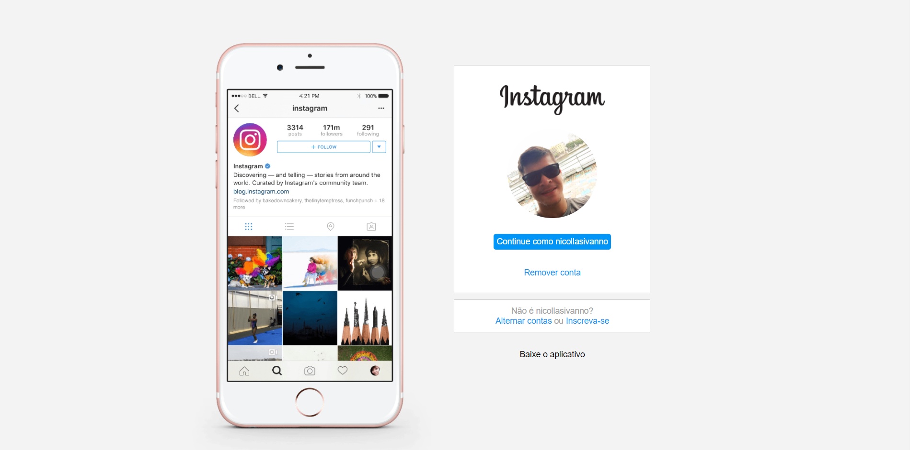

# Linguagens de Marcação
## Estudos voltado para a aprendizagem do HTML5 e CSS3 trabalhadas de forma conjunta, no mesmo foi desenvolvido o clone da página web inicial do Instagram.
 
 * [📝 Curso] 
 - [Digital Innovation](https://digitalinnovation.one/)
 
 - [💻 IMAGEM DA PÁGINA DESENVOLVIDA]
 
 

